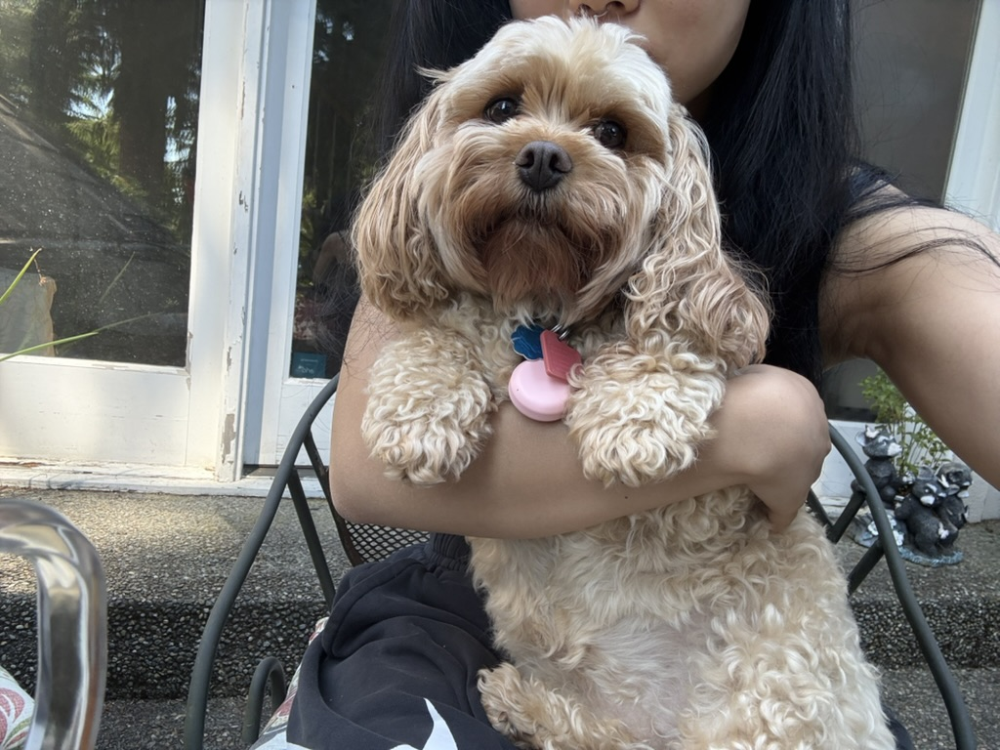

# hi! i'm melanie
welcome to my github profile! i'm a recent graduate from new york university with majors in computer science and psychology, and a minor in digital design.

## i'm looking for...
a full-time product/ux, pm, or swe role! open to SEA/SF/NYC & more!

## you might be looking for...
- love garden
- cache
- asl interpreter
- resume-ly
- <a href="https://www.melaniezhang.io/" target="_blank">my website</a>
- my coding buddy <3
  
  

<!--
**melanie-y-zhang/melanie-y-zhang** is a ✨ _special_ ✨ repository because its `README.md` (this file) appears on your GitHub profile.

Here are some ideas to get you started:

- 🔭 I’m currently working on ...
- 🌱 I’m currently learning ...
- 👯 I’m looking to collaborate on ...
- 🤔 I’m looking for help with ...
- 💬 Ask me about ...
- 📫 How to reach me: ...
- 😄 Pronouns: ...
- ⚡ Fun fact: ...
-->
